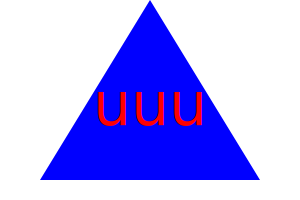
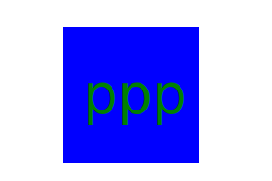

# A SVG Logo generator

## Description

To create a svg logo generator.
which can be used create any logo with ease.
A logo is an essential item for any company.
I learned how to work with node.js, jest, inquier.
I used classes to simply the code workflow.
I used jest to run unit tests on the code.

## Table of Contents:

[Installation](#Installation)
[Video Link](#video)
[Usage](#usage)
[Credits](#credits)
[License](#license)
[Questions](#questions)

## Installation

- Clone repository to local machine
- run npm install
- To start the progam run: node injex.js
- When you enter more than 3 letters, just press the backspace to continue.

## Video

https://drive.google.com/file/d/1vVIiT3vckBCwF3Sz8sS7H1OQx_e-mF6x/view?usp=sharing

## Screenshot of svg files

## Usage

This application will enable a user to quickly create a logo for a company.

## Credits

I used and modified code from the following resouces.

- https://www.npmjs.com/package/inquirer-maxlength-input-prompt
- https://www.youtube.com/watch?v=FgnxcUQ5vho
- https://www.youtube.com/watch?v=PQxtlY19kto&list=PLL8woMHwr36F2tCFnWTbVBQAGQ6nTcXOO
- https://babeljs.io/setup#installation
- https://babeljs.io/setup#installation
- https://jestjs.io
- https://www.youtube.com/watch?v=GJYMcLus3v0

## License

MIT License

## Contact information

Github Username: woestyn101
Github profile: https://github.com/woestyn101
email: woestyn101@gmail.com
